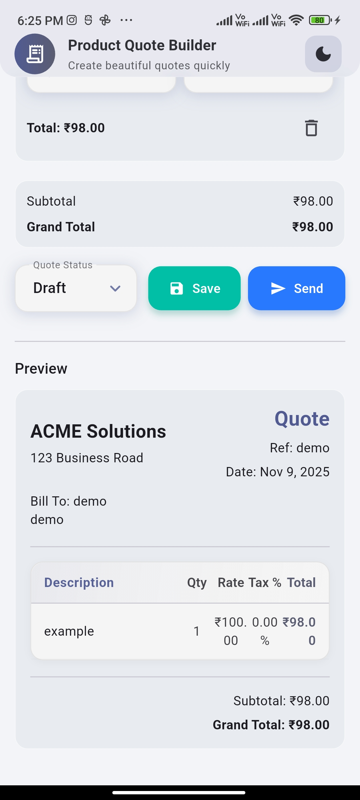
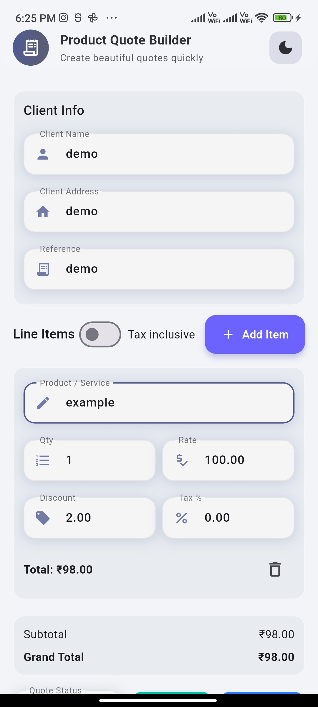

<h1 align="center">🧾 Product Quote Builder</h1>

<p align="center">
  <i>A beautifully designed Flutter app to create, manage, and preview product quotes with stunning UI and smooth animations.</i>
</p>

<p align="center">
  
  
  
  
</p>

---

## ✨ Overview

**Product Quote Builder** is a sleek, modern Flutter application for generating professional quotes within seconds.  
Built using **Material 3**, **Glassmorphism**, and smooth transitions — it provides a premium user experience for freelancers, businesses, and agencies.

---

## 💎 Features

- 🧠 Smart & minimal UI with glassmorphism design  
- 🧮 Auto calculation for subtotal, tax, and total  
- 💾 Local saving support (ready for persistent storage)  
- 💡 Real-time quote preview  
- 🌗 Light / Dark theme toggle  
- ⚡ Responsive design for mobile, web, and desktop  

---

## 🖼️ UI Preview

| UI | UI |
|-------------|-----------|
|  |  |


---

## 🧱 Folder Structure

```bash
lib/
├── main.dart
├── presentation/
│   ├── pages/
│   │   └── quote_builder_page.dart
│   ├── widgets/
│   │   ├── glass_card.dart
│   │   ├── modern_text_field.dart
│   │   └── modern_dropdown.dart
├── data/
│   ├── models/
│   └── local_storage/
└── core/
    ├── theme/
    ├── utils/
    └── constants/
